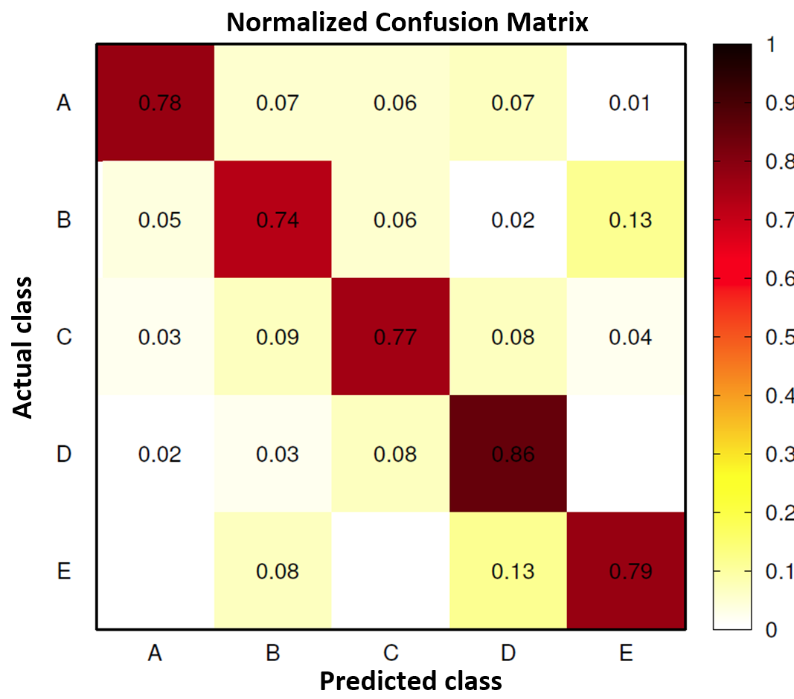

```{r setup, include=FALSE, cache=FALSE}
suppressPackageStartupMessages({
library(knitr)
library(class)
library(caret)
library(party)
library(RANN)
})
opts_chunk$set(echo = FALSE, cache = FALSE, cache.path = "../PML_Project_cache/")
load("../PML_Project_cache/project.RData")
#pml_training <- read.csv(file="./data/pml-training.csv", na.strings=c("NA", "#DIV/0!"))[,-1]
#pml_testing <- read.csv(file="./data/pml-testing.csv" ,na.strings=c("NA", "#DIV/0!"))[,-1]
```
  
**[Check source files for making this web page](https://github.com/SCgeeker/PML_Project)**
  
### Preview WLE Dataset
Using dumbbell is the popular class in the weight lifting exercise. However, some incorrect actions in using dumbbell might harm users' health. The devices that could detect user's action will help people avoid these mistakes. These devices need a statistical model installed in the software to recognize user's action patterns. [Velloso et al.](http://groupware.les.inf.puc-rio.br/work.jsf?p1=11201) collected the data from 6 volunteers who were making correct and incorrect actions in 5 classes. The complete data set is avaiable at [this site](http://groupware.les.inf.puc-rio.br/har). There are 39,242 observations in this data set.

This project aims to [The training data](https://d396qusza40orc.cloudfront.net/predmachlearn/pml-training.csv) and [the testing data](https://d396qusza40orc.cloudfront.net/predmachlearn/pml-testing.csv) are downloaded from Coursera data pool. The training data colleted `r dim(pml_training)[1]` observations from the original data set. The testing data selected 20 observations for the other homework. Each data set has 152 features to train the model and to test the prediction accuracy.

## Aims
This project reproduced the analysis on the data sets and investigates the overfitting problem the algorithms Velloso et al. used and we used. The algorithm used in the original work was Random Forest. [This figure](./img/wle_confusion_matrix.png) illustrates the accuracies and errors this model's predictions.  

In this project, We attempt k-nearest neighbour (available in `class` package) and Boosting (available in `caret` package) to predict the outcomes. In use of Boosting method, 70% of training data set was used to train the model and 30% was used to calcuate out of sample errors.

**Note.** For saving comuptation time, the results were saved in an image file before we compiled this webpage. This webpage loads the processed data from the image file and demostrates the critical codes to acquire these results.  

### Features Selection
Within 152 features, only 17 features were used in Velloso's original work. To save the computation resource, we selected 32 features according to the description in Velloso's paper. These features are as below list.  
```{r features, echo=FALSE, results='markup', warning=FALSE, message=FALSE}
AuthorSelected
```

In training and testing data sets, these features and the outcome variable (classe) are retrieved and stored in the new data frames. 30% of `TrainCleaned2` were sampled for calcuating the out of sample errors of Boosting model later.
```
TrainCleaned2 <- data.frame(classe = pml_training[,159], pml_training[,AuthorSelected])
TestCleaned2 <- data.frame(classe = pml_testing[,159], pml_testing[,AuthorSelected])
cvInd <-  createDataPartition(y = TrainCleaned2$classe, p=0.3,list=FALSE)
TCSet <- TrainCleaned2[-cvInd,]
CVSet <- TrainCleaned2[cvInd,]
```

### Pre-processing Missing Data
Within 32 features, 3 features, *avg_roll_belt*, *var_roll_belt*, and *var_total_accel_belt*, had NA values. We used imputation method to rescale these features in the training data set.
```
preTrainCleaned2 <- preProcess(TrainCleaned2[,-1], method="knnImpute")
avgTrainCleaned2 <- predict(preTrainCleaned2, TrainCleaned2[,-1])

TrainCleaned2$avg_roll_belt <- avgTrainCleaned2$avg_roll_belt
TrainCleaned2$var_roll_belt <- avgTrainCleaned2$var_roll_belt
TrainCleaned2$var_total_accel_belt <- avgTrainCleaned2$var_total_accel_belt
```
```{r TrainImpu, echo=FALSE, results='markup', warning=FALSE, message=FALSE}
head(TrainCleaned2)[1:10]
```

These features in the testing data set are transfered to zero.
```
TestCleaned2$avg_roll_belt <- 0
TestCleaned2$var_roll_belt <- 0
TestCleaned2$var_total_accel_belt <- 0
```

### Prediction Method 1: k-Nearest Neighbour Classification
Firstly we used k-nearest neighbor algorithm and obtained the answers for the problems in the test data set. This method calculates the similarities of features given numer of nearest neighbors (k) we set up initially. `knn` in `class` package provides the probability to predict the answer instead of conducting a model to evaluate the prediction errors. We ran the algorithm from k = 1 to k = 20. To decide which k have the best prediction, we plot the average and minimal probabilities as the below Figure shows:
```
knnPred <- matrix("ans", 20, 20)
knnPredProb <- matrix(0, 20, 20)
for(i in 1:20)
{
  knnPred[,i] <- as.character( knn(TrainCleaned2[,-1], TestCleaned2[,-1], TrainCleaned2$classe, k=i, prob=TRUE ) ) 
  knnPredProb[,i] <- attributes( knn(TrainCleaned2[,-1], TestCleaned2[,-1], TrainCleaned2$classe, k=i, prob=TRUE ) )$prob
}
```
```{r knnplot, echo=FALSE, results='markup', warning=FALSE, message=FALSE}
plot(1:20, apply(knnPredProb, 2, min), ylim=0:1, type="b", col=8, xlab = "number of neighbours(K)", ylab = "Proportion of the votes for the winner", main = "Average proportion and the smallest proportion for per K")
lines(1:20, apply(knnPredProb, 2, mean), type="b", col=6)
```

The average probability smoothly decreased from 100% to 85%. The point at **k=5** appears a significant twist in this trend. Since the calculation at k=2, one point with a probability approaching 50% raised. It has converged to 50% at **k=5**. We decide the predictions at **k=5** as our answers for the other homework. Our predictions for the 20 problems are `r knnPred[,5]`.

### Prediction Method 2: Boosting
We dcided Boosting algorithm because it could weight many weak predictors and add them into the model iteratively. This final model was bulit based on the method `gbm`.
```
gbmFIT <- train(classe ~ ., method = "gbm", data = TCSet)
```
```{r gbmFIT, echo=FALSE, results='markup', warning=FALSE, message=FALSE}
print(gbmFIT)
```
The results outputed by `confusionMatrix()` illustreated how accurate this model predict.
```{r confusion, echo=FALSE, results='markup', warning=FALSE, message=FALSE}
confusionMatrix( TCSet$classe,   predict(gbmFIT, TCSet) ) 
```
This model gave the alternative answers for the default testing data:
```{r gbmANS, echo=FALSE, results='markup', warning=FALSE, message=FALSE}
print( predict(gbmFIT, TestCleaned2) )
```

### Overfitting Problem
Transfered the confusion matrix of current result to the propotion, we found that the model built by Boosting algorithm have higher accuracies than the original model on the training data set. Our model might have a high out of sample error.
```{r confusionProb, echo=FALSE, results='markup', warning=FALSE, message=FALSE}
round(table(predict(gbmFIT, TCSet), TCSet[,1])/summary(TCSet[,1]), digits=2)
```
</br>
</img>
</br>
```
cvPred <- predict(gbmFIT, CVSet)
gbmOSE <- (1 - sum(cvPred == CVSet$classe)/nrow(CVSet))
```
We produced the prediction values based on the sample data for the cross validation. In our work, the estimated out of sample error is `r round(gbmOSE, digits=2)`.
